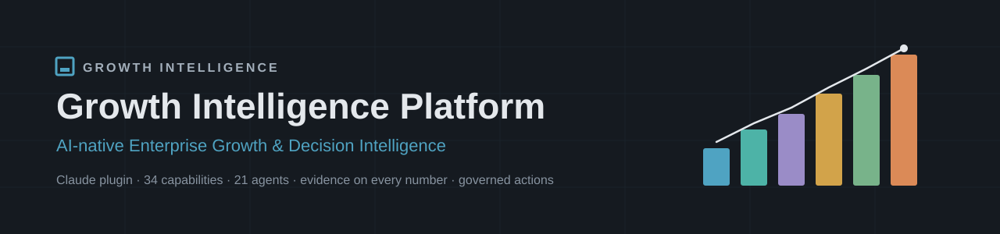
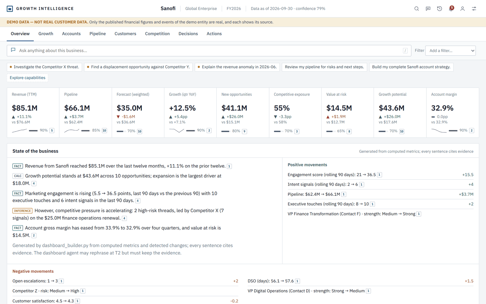
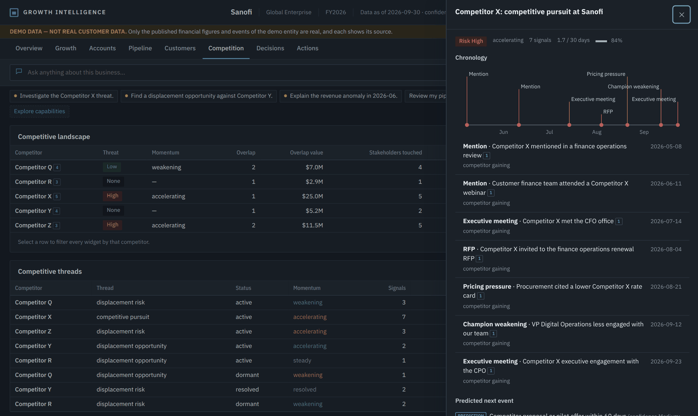
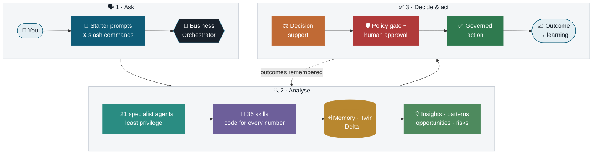
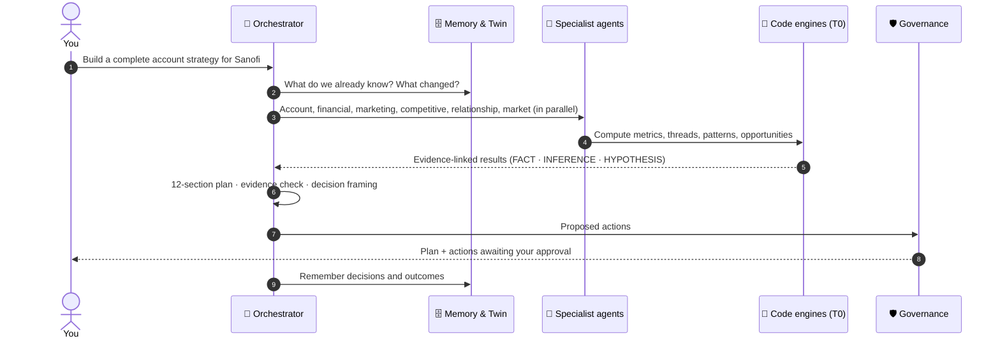

<p align="center">
  
</p>

<p align="center">
  
  
  
  
  
  
</p>

<h3 align="center">Ask in business language. Get evidence-backed answers, decisions and governed actions.</h3>

<p align="center">
  An AI-native <b>Enterprise Growth &amp; Decision Intelligence Platform</b> that runs inside Claude, above any CRM, ERP or data source.<br>
  You never pick a tool: you say what you want to accomplish, and the platform plans, analyses, explains and proposes the next step.
</p>

<p align="center">
  <a href="#-start-here">Start here</a> ·
  <a href="#-what-it-can-do">Capabilities</a> ·
  <a href="#-see-it">Screenshots</a> ·
  <a href="#-how-it-works">Architecture</a> ·
  <a href="#-trust-by-design">Trust</a> ·
  <a href="#-quick-start">Quick start</a> ·
  <a href="#-quality">Quality</a> ·
  <a href="#-release-history">Releases</a>
</p>

> [!NOTE]
> The examples and screenshots use **demo data** (Sanofi as a demonstration account). Only Sanofi's published financial figures are real, and each shows its source. Everything else is labelled **DEMO DATA — NOT REAL CUSTOMER DATA**.

---

## 🚀 Start here

Type **`/growth`** in Claude Code, or ask **"What can you do?"** anywhere. You get a short, personalized menu:

```text
GROWTH INTELLIGENCE · What would you like to do?

  ▶ Build my complete account strategy.
  ▶ Find my biggest growth opportunities.
  ▶ Prep me for my next sales call.
  ▶ Review my pipeline for risks and next steps.
  ▶ What has changed in this account?
  ▶ Give me today's growth briefing.

  Explore capabilities →  Growth · Sales · Accounts · Customers · Competition · Marketing · Finance · Market · Meetings · Decisions · Dashboards · Operations
```

Prompts adapt to **who you are** (13 personas: Investor · CEO · CFO · COO · Growth Operations Head · CRO · Sales Head · Sales Director · Account Executive · Marketing Leader · Customer Success Leader · Operations Leader · IT Leader) and **what you are looking at**. With Sanofi open they say *"Build my complete Sanofi account strategy."* When the data shows an accelerating competitor, a prompt like *"Investigate the Competitor X threat."* appears, and only then.

> [!TIP]
> Every capability has its own command (`/account`, `/deal`, `/forecast`, `/threads`, `/financial`, `/dashboard`…). Type it on its own to see its six best prompts, or add your request: `/deal what could stop us winning?`

---

## 🧭 What it can do

**34 capabilities · 204 headline prompts · 342 more by category · 38 slash commands.** The platform covers far more than sales:

| Area | Capability | Command | Try |
|:--|:--|:--|:--|
| 📈 **Growth** | **Business Analysis** | `/bi` | _Analyze my business._ |
| 📈 **Growth** | **Daily Briefing** | `/briefing` | _Give me today's growth briefing._ |
| 📈 **Growth** | **Executive Command Center** | `/executive` | _Give me the state of the business._ |
| 📈 **Growth** | **Growth Opportunities** | `/opportunities` | _Find my biggest growth opportunities._ |
| 📈 **Growth** | **Growth Signals** | `/signals` | _Show me the strongest growth signals._ |
| 💼 **Sales** | **Deal Strategy** | `/deal` | _Assess the health of this deal._ |
| 💼 **Sales** | **Pipeline & Forecast** | `/forecast`, `/pipeline` | _Review my pipeline for risks and next steps._ |
| 💼 **Sales** | **Prospect Research & Outreach** | `/outreach` | _Research this prospect for me._ |
| 💼 **Sales** | **RFP Response** | `/rfp` | _Analyze this RFP._ |
| 💼 **Sales** | **Win/Loss** | `/winloss` | _Analyze why we won._ |
| 🏢 **Accounts** | **Account Planning & SWOT** | `/account-plan` | _Build my account plan._ |
| 🏢 **Accounts** | **Account Intelligence** | `/account` | _Build my complete account strategy._ |
| 🤝 **Customers** | **Customer Growth** | `/customer-growth` | _Find expansion opportunities with existing customers._ |
| 🤝 **Customers** | **Customer Digital Twin** | `/digital-twin` | _Show me the current customer state._ |
| 🤝 **Customers** | **Relationships** | `/relationships` | _Map the key stakeholders._ |
| 🤝 **Customers** | **Renewals & Expansion** | `/renewals` | _Show me accounts at renewal risk._ |
| ⚔️ **Competition** | **Competitive Intelligence** | `/competition` | _Show me the competitive landscape._ |
| ⚔️ **Competition** | **Competitive Threads** | `/threads` | _Show me active competitive threads._ |
| 📣 **Marketing** | **Marketing Intelligence** | `/marketing` | _Show me marketing activity affecting this account._ |
| 💰 **Finance** | **Financial Intelligence** | `/financial` | _Show me the financial story._ |
| 💰 **Finance** | **Pricing** | `/pricing` | _Analyze the pricing for this deal._ |
| 🌍 **Market** | **Market Intelligence** | `/market` | _What's changing in this market?_ |
| 🗓️ **Meetings** | **Meeting Follow-through** | `/followup` | _Process my call notes into follow-ups._ |
| 🗓️ **Meetings** | **Meeting Preparation** | `/meeting` | _Prep me for my next sales call._ |
| ⚖️ **Decisions** | **Decision Support** | `/decision` | _Help me evaluate this decision._ |
| ⚖️ **Decisions** | **Scenario Planning** | `/scenario` | _Run a best, base and worst-case scenario._ |
| 📊 **Dashboards** | **Dashboards** | `/dashboard` | _Show me my growth command center._ |
| ⚙️ **Operations** | **Actions** | `/actions` | _Show me my highest-priority actions._ |
| ⚙️ **Operations** | **Data Analysis** | `/data` | _Analyze this dataset._ |
| ⚙️ **Operations** | **Knowledge** | `/knowledge` | _Find the relevant knowledge for this account._ |
| ⚙️ **Operations** | **Business Memory** | `/business-memory` | _What do we already know about this account?_ |
| ⚙️ **Operations** | **Solution Design** | `/solution`, `/architecture` | _Design a solution for this opportunity._ |
| ⚙️ **Operations** | **Business Watch** | `/watch` | _Alert me when a big deal slips._ |

<details>
<summary><b>📋 The seven prompt categories</b> (how every "More prompts" list is organised)</summary>

| 🔎 Discover | 📊 Analyze | 🕵️ Investigate | ⚖️ Decide | 📝 Prepare | ✅ Act | 👁️ Monitor |
|:--:|:--:|:--:|:--:|:--:|:--:|:--:|
| Understand the business | See what is happening | Find evidence and drivers | Evaluate options | Briefs, plans, meetings | Create actions | Watch changes and signals |

</details>

---

## 🖼️ See it

**Enterprise Growth Command Center:** a persona-adapted, evidence-linked dashboard rendered as a Claude Artifact.

<p align="center"></p>

<details>
<summary><b>🌙 Dark mode: a competitive thread as one evolving story</b></summary>
<br>
<p align="center"></p>

Seven signals about one competitor (a mention, a webinar, executive meetings, an RFP, pricing pressure, a weakening champion) form **one thread**. It shows velocity, momentum, counter-evidence, a labelled prediction and recommended actions that need approval.
</details>

**Highlights:**
- **🧮 Every number computed in code.** The dashboard never calculates; it displays a validated contract.
- **🔍 Every number clickable.** Drill down from growth potential to driver, opportunity, evidence, signals and action.
- **🧷 Every number sourced.** A small provenance mark opens source, date, confidence and claim type.
- **🎛️ Cross-filtering, scenarios, comparisons,** nine persona views, and light and dark themes.
- **🚫 No fake zeros.** Missing data shows *"Not available"* and says what is needed.

To try it, run `python tools/build_demo_dashboard.py`, then open `examples/enterprise-growth-command-center.html` in a browser.

---

## 🏗️ How it works



<details>
<summary><b>🔬 What happens when you ask "Build a complete account strategy for Sanofi"</b></summary>
<br>


</details>

| Layer | What it does |
|:--|:--|
| 🚀 **Starter prompts** | 34 capabilities, persona- and context-aware prompts, follow-ups and signal-driven suggestions |
| 🧠 **Business Orchestrator** | Understands the request, plans, finds the right agents in a registry, and checks what changed first |
| 🤖 **21 specialist agents** | Account, deal, pipeline, financial, marketing, competitive threads, relationships, dashboards and more. They analyse and propose; they never act on their own |
| 🧮 **Code engines (T0)** | Every calculation is deterministic code, never a language model doing arithmetic |
| 🗄️ **Memory · Digital Twin · Delta** | Remembers facts, decisions and outcomes; tracks eight state domains over time; recomputes only what changed |
| 🔗 **Cross-domain signals** | Connects marketing, finance and competition into growth and risk patterns, labelled as hypotheses |
| 🛡️ **Governance** | Tenant isolation, role and data permissions, financial-data clearance, a policy gate, and human approval before any action |

---

## 🛡️ Trust by design

| Claim type | Meaning |
|:--|:--|
|  | Measured, with a source |
|  | Calculated in code from sourced inputs |
|  | Reasoned from evidence |
|  | Related, not proven to cause |
|  | To be tested before acting |
|  | Forward-looking, with confidence |
|  | Proposed action; needs approval |

> [!IMPORTANT]
> The platform **never invents data**. Missing values are reported as missing, estimates are never presented as facts, and campaign influence is called *correlation* unless a controlled test proves causation. Consequential actions always go through a policy check and a human approval.

---

## 💻 Quick start

### Set up for development
```bash
python -m venv .venv
# Windows: .venv\Scripts\activate     macOS/Linux: source .venv/bin/activate
python -m pip install -r requirements-dev.txt
python -m playwright install chromium        # for the dashboard tests
python tests/run_offline.py                  # quick check
```

### Use it in Claude Code
The repository root **is** the plugin. Validate it with `claude plugin validate .`, add it to Claude Code, then type **`/growth`**.

> [!WARNING]
> On Windows, run Python with UTF-8 mode on (`$env:PYTHONUTF8=1` in PowerShell). VS Code's terminal and tasks in this repository set it for you.

Full guide: [`docs/DEVELOPMENT.md`](docs/DEVELOPMENT.md)

---

## 🧪 Quality

<p>
  
  
  
  
</p>

| Suite | Tests | Command |
|:--|--:|:--|
| 🚀 Starter prompts & discovery | **263** | `python tests/run_prompts.py` |
| 📊 Dashboard (in a real browser) | **83** | `python tests/run_dashboard.py` |
| 🧠 Marketing, financial, competitive, twin, memory | **104** | `python tests/run_v71.py` |
| 🤖 Orchestration and regression | **38** | `python tests/run_offline.py` |
| **Total** | **488** | all passing |

Visual QA at 1280, 1440, 1600 and 1920 px in light and dark mode: no overflow, no truncated numbers, consistent values across widgets.

---

## 📁 Repository layout

```text
growth-intelligence-platform/
├── 🧩 skills/              36 skills (instructions + code engines)
├── 🤖 agents/              21 specialist agents (generated from registry/)
├── 📒 registry/            agent manifests, agent and skill registries
├── ⌨️ commands/            38 slash commands (generated from the prompt catalog)
├── 🛡️ policy/              action catalog and tenant policy
├── 📐 schemas/             Dashboard Contract (JSON Schema)
├── 🧪 tests/               488 automated tests + fixtures
├── 🎯 evals/               14 live evaluation cases for Claude Code
├── 🛠️ tools/               catalog generators, demo dashboard builder
├── 📚 docs/                architecture, release reports, guides
└── 🛠️ (examples/ is generated by tools/build_demo_dashboard.py)
```

---

## 🗺️ Release history

| Version | Theme | Highlights |
|:--|:--|:--|
| **V8.0** | 🚀 Starter prompts & discovery | `/growth` front door, 34 capabilities, 13 personas, signal-driven prompts; typed routing of headline prompts raised from 50% to 100% |
| **V7.2** | 📊 Dashboard intelligence | Dashboard Contract, Command Center artifact, nine personas, design system |
| **V7.1** | 🔗 Cross-domain intelligence | Marketing, financial and competitive-thread intelligence; cross-domain patterns; digital twin domains |
| **V7.0** | 🤖 Agentic business OS | Business Orchestrator, 17 domain agents, registry, policy gate, action manager, traces |
| **V6.x** | 🗄️ Memory & context | Business memory graph, context discovery, delta, model routing, delegation protocol |
| **V1–V5** | 🌱 Foundations | 21 growth and sales intelligence skills |

Details: [`CHANGELOG.md`](CHANGELOG.md) and the release reports in [`docs/`](docs)

---

## ⚠️ Known limitations

- **Live agent runs** (sub-agents in Claude Code) and the slash-command menu are verified by structure and offline tests. The live evaluation cases need a Claude account (`bash tests/run_agent_tests.sh`).
- **Claude.ai chat** does not load plugin slash commands; there, start with *"What can you do?"*.
- **Typed versions of the 342 additional prompts** route correctly 86% of the time; clicked prompts and slash commands always route correctly.
- **Published dashboards** copy a question for you to paste into chat rather than sending it.
- **Demo data:** internal account data is synthetic; health and risk rules are documented heuristics, not yet calibrated on real outcomes.

---

## 📚 Documentation

| | |
|:--|:--|
| 🏗️ [Architecture](ARCHITECTURE.md) | Layers, request flow, design decisions |
| 🔌 [Connectors](CONNECTORS.md) | Data sources and what each one powers |
| 🧪 [Tests](tests/README.md) | What every suite covers |
| 🛠️ [Development](docs/DEVELOPMENT.md) | Setup, tests, regenerating prompts |
| 📦 [V8 release report](docs/18-v8-starter-prompts.md) | Starter prompts: design, routing, results |
| 📊 [V7.2 release report](docs/17-v72-dashboard.md) | Dashboard intelligence |

---

<p align="center">
  Built by <b>Sumit Mattey</b> ·
  <a href="https://www.linkedin.com/in/sumitmattey"></a>
</p>
